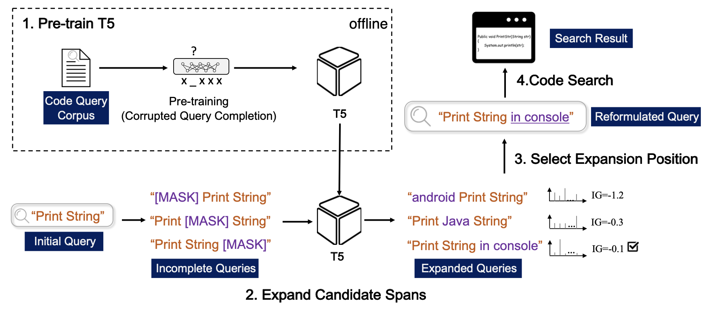
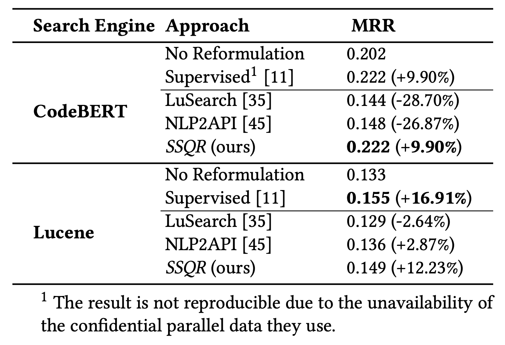
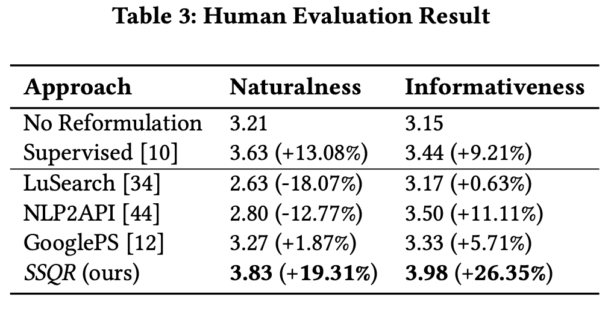

# Self-Supervised Query Reformulation for Code Search
This repo is for the resources of Self-Supervised Query Reformulation for
Code Search. This repo is divided into two parts:

* [Pretraining](https://anonymous.4open.science/r/FSE2023-4287/Pretraining/README.md): Including the code and dataset for pre-training T5.

* [Query Reformulation](https://anonymous.4open.science/r/FSE2023-4287/Query%20Reformulation/README.md): Including the data and code for finetuning CodeBERT to perform code search, and the code for reformulating the code search test set.

### Our SSQR Approach

We propose SSQR, a self-supervised query reformulation method that does not rely on any parallel query corpus. Inspired by pre-trained models, SSQR treats query reformulation as a masked language modeling task over a large-scale unlabelled corpus of queries. SSQR extends T5 (a sequence-to-sequence model based on Transformer) with a new pre-training objective named corrupted query completion (CQC), which randomly masks words from a complete query and asks T5 to predict the masked content. Then, for a given query to be reformulated, SSQR enumerates candidate positions to be expanded and employs the pre-trained T5 model to generate the content to fill the spans. Finally, SSQR selects expansion positions where information is likely to be missing.

 

### Results

We pre-train T5 using code comments from the large-scale CODEnn dataset and perform code search experiment on the code search dataset of CodeXGLUE. Our evaluation shows that SSQR significantly outperforms unsupervised baselines and gains competitive performance over supervised methods.

- Performace on Code Search

* Qualitative Evaluation

